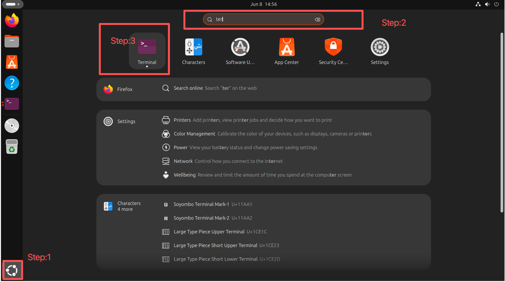
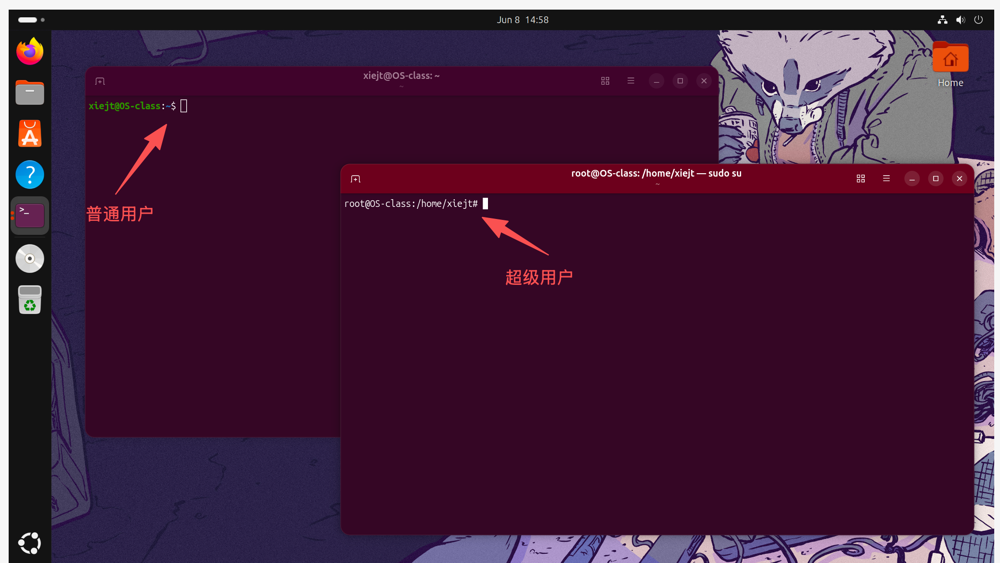
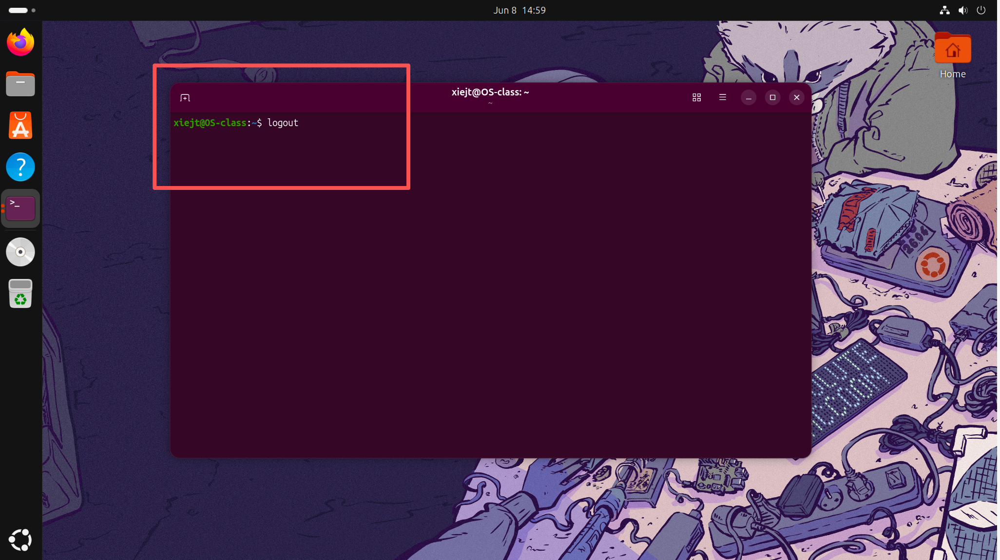
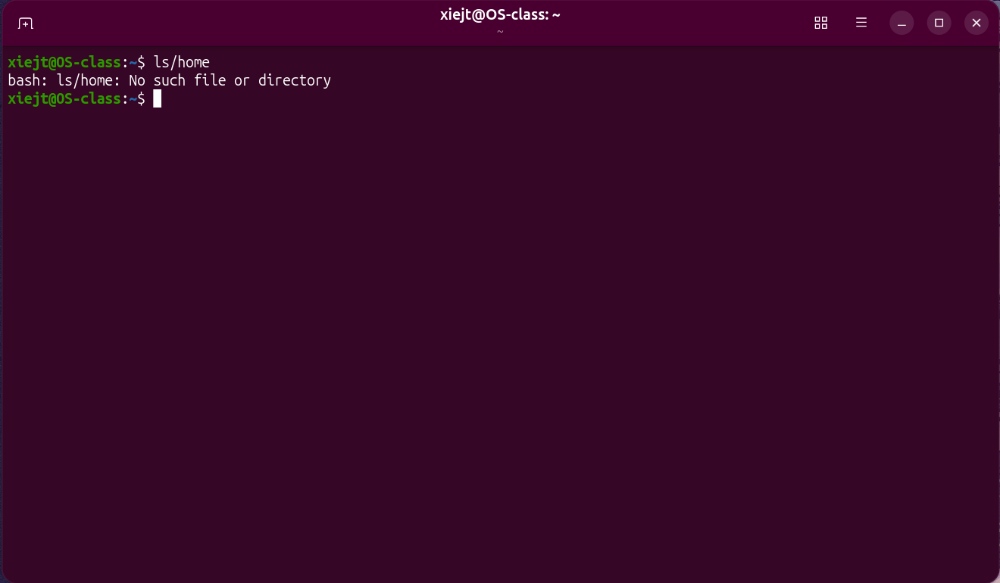
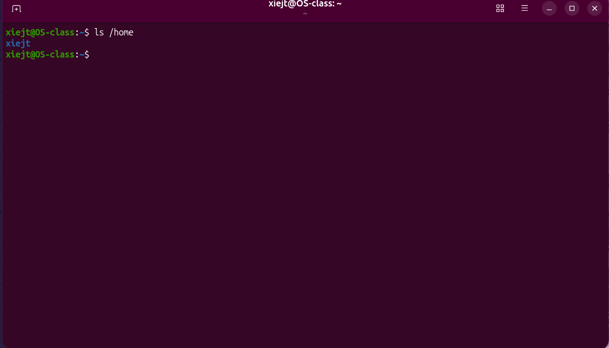
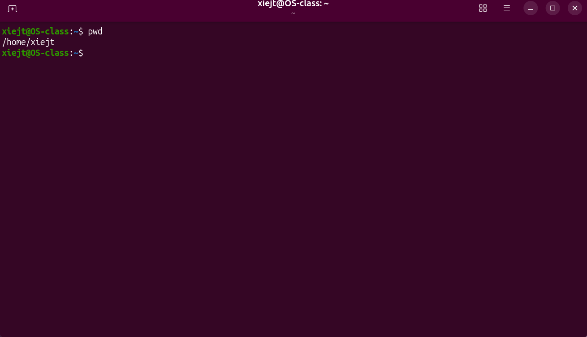
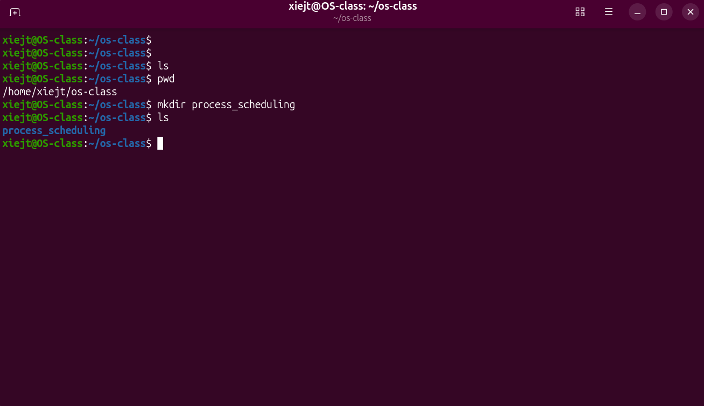
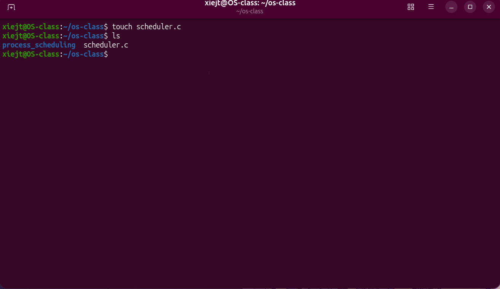
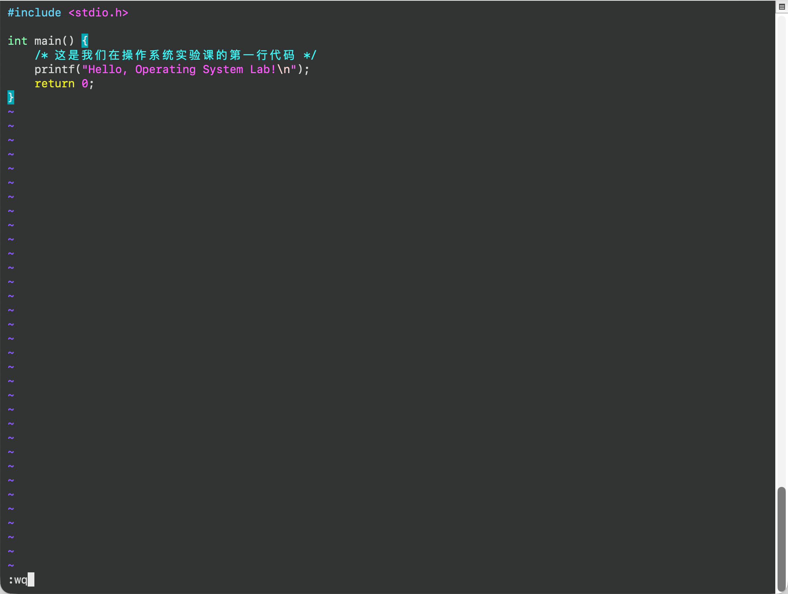

# 操作系统实验课前置导引：Linux 命令行与开发环境全解析

欢迎来到 Linux 的世界。对于习惯了图形界面的同学，初次面对黑色的终端窗口（Terminal）可能会感到无从下手。但请记住：命令行并非玄学，它是你与操作系统内核对话的最直接、最高效的方式。掌握它，是你深入理解进程管理、内存分配和文件系统等核心概念的第一步。


## 零、 身份与大门：登录、注销与关机

在 Linux 系统中，安全和权限是刻在骨子里的。你的每一个操作都与你的“身份”绑定。

### 1. 登录与提示符



当你打开终端或通过 SSH 连接到服务器时，系统会要求输入用户名和密码（注意：输入密码时屏幕不会有任何星号提示，敲完回车即可）。登录成功后，你会看到类似这样的提示符：

- `$`：代表你是**普通用户**。这就像普通的员工工牌，只能操作属于自己的文件。
- `#`：代表你是**超级用户（root）**。这拥有系统的最高权限，可以执行任何操作，但也极其危险，日常练习中请尽量使用普通用户。



### 2. 注销退出

当你完成实验，需要退出当前 Shell 会话时，你有两种优雅的方式：

- 输入命令：`logout` 或 `exit`
- 快捷键：按下 `Ctrl + D`



### 3. 电源管理：关机与重启

在 Linux 中，关机和重启的实质是**切换系统的运行级别（Runlevel）**。0 代表停机，6 代表重启。

- **关机命令：**
  - `init 0`：切换到停机级别。
  - `halt`：立即停止系统运行。
  - `shutdown -h now`：立即关机。
  - `shutdown -h +5`：5分钟后关机。
- **重启命令：**
  - `init 6`：切换到重启级别。
  - `reboot`：立即重启。
  - `shutdown -r now`：立即重启。
- **`shutdown` 命令的特殊选项：**
  - `-k`：并不会真的关机，只是向所有登录的用户发送警告信息（例如：“系统将在5分钟后维护”）。

## 一、 与系统对话：命令的基本语法与求生指南

### 1. 命令的基本格式

所有的 Linux 命令都遵循一个万能公式：

Bash

```
命令  [选项]  [参数]
```

**🚨 极其重要的新手陷阱：** 命令、选项和参数之间**必须用空格隔开**！

- 错误写法：`ls/home` （系统会以为你在找一个叫 'ls/home' 的命令）

  

- 正确写法：`ls /home`




**选项（Options）：** 改变命令的默认行为。

- **短选项：** 用一个短横线加字母表示，如 `ls -a /home`。多个短选项可以合并，例如 `ls -al`。
- **长选项：** 用两个短横线加单词表示，如 `ls --all /home`。

**参数（Arguments）：** 命令作用的对象（通常是文件或目录）。例如上面的 `/home` 就是参数。

### 2. 求生指南：如何查看帮助文档

在 Linux 中遇到不会的命令，千万别急着去网上搜，系统自带了最权威的说明书。

- **`man`（Manual 的缩写）：最常用的说明书**
  - 格式：`man 命令名`（例如：`man ls`）
  - 操作：使用 `↑`、`↓` 键或 `PageUp`、`PageDown` 逐行/逐页阅读。**按 `q` 键退出**。
- **`info`：更详细的超链接说明书**
  - 格式：`info 命令名`（例如：`info gcc`）
  - 操作：同样使用上下方向键翻页，按 `Enter` 键进入带有 `*` 号的超链接，按 `q` 键退出。按 `Ctrl + H` 可查看 info 的操作帮助。

## 二、 建立空间感：目录树与路径导航

Linux 没有 C盘、D盘，所有的文件都挂载在一个根目录 `/` 下，呈现倒置的树状结构。

### 1. 绝对路径 vs 相对路径（核心概念！）

- **绝对路径：** 从根目录 `/` 开始写起，是文件在系统中的确切、唯一的地址。例如：`/home/student/workspace/lab1.c`。
- **相对路径：** 从你**当前所在的位置**出发寻找文件。这依赖于两个极其重要的特殊符号：
  - `.` （单点）：代表**当前目录**。
  - `..` （双点）：代表**上一级目录（父目录）**。

### 2. 导航与定位命令

- `pwd` (Print Working Directory)：**我在哪？** 打印当前所在的绝对路径，迷路时必用。



- `cd` (Change Directory)：**我要去哪？** 切换目录。
  - `cd /etc`：使用绝对路径，跳转到 `/etc`。
  - `cd ../etc`：使用相对路径，先退回上一级，再进入 `etc` 文件夹。
  - `cd ~`：直接回到当前用户的“家目录”（Home）。
- `ls` (List)：**周围有什么？** 查看目录内容。
  - `ls`：简单列出当前目录的文件。
  - `ls /home`：列出指定目录下的文件。

## 三、 创世与毁灭：文件与目录的增删改查

### 1. 创建操作

- `mkdir 目录名` (Make Directory)：创建新文件夹。例如：`mkdir process_scheduling` 创建一个名为 process_scheduling 的目录。



- `touch 文件名`：创建一个空的文本文件，或更新已有文件的时间戳。例如：`touch scheduler.c`。



### 2. 移动与复制

- `cp` (Copy)：复制文件或目录。
  - `cp file1.txt file2.txt`：复制并重命名。
  - `cp -r dir1 dir2`：**极其重要**，`-r` 表示递归（recursive），复制整个文件夹及其里面的所有内容必须加这个选项。
- `mv` (Move)：移动文件/目录，或者重命名。
  - `mv old.c new.c`：在同一个目录下移动，相当于**重命名**。
  - `mv file.c /home/student/`：将文件移动到指定目录。

### 3. 删除操作（⚠️ 警告：Linux 没有回收站！）

- `rmdir 目录名`：只能删除**空**的目录。
- `rm 文件名`：删除文件。
- `rm -r 目录名`：强制删除目录及其内部所有内容。**使用时请反复确认当前路径！**

### 4. 窥探文件内容

- `cat 文件名`：将文件内容一次性全部打印在屏幕上。适合看短小代码。
- `more` / `less`：分页查看长文件。`less` 更强大，允许使用上下键回滚查看，按 `q` 退出。
- `head -n 10 文件名`：只看文件的前 10 行。
- `tail -n 10 文件名`：只看文件的最后 10 行。常用来查看实时更新的系统日志。

## 四、 进阶搜索与魔法：通配符

当你忘记了全名，或者想一次性操作一堆文件时，通配符是你的好帮手。

- `*` (星号)：代表**零个或多个**任意字符。
  - `ls *.c`：列出当前目录下所有以 `.c` 结尾的 C 语言源文件。
- `?` (问号)：代表**严格的一个**任意字符。
  - `ls lab?.c`：能匹配 `lab1.c` 或 `lab2.c`，但匹配不到 `lab10.c`。
- `[]` (中括号)：指定一个字符的范围或列表。
  - `ls [a-i]*.txt`：匹配以 a 到 i 之间任何一个字母开头的 txt 文件。
- `!` (感叹号)：与中括号结合，表示**排除**。
  - `ls [!a]*.c`：列出所有**不是**以字母 a 开头的 C 文件。

## 五、 打包与压缩：整理你的实验资产

Linux 中，**打包**（把多个文件绑在一起）和**压缩**（减小文件体积）通常是分开的概念，但 `tar` 命令将它们完美结合。

### 1. 万能的 `tar` 命令

你最常遇到的格式是 `.tar.gz`。记住这组“起手式”：

- **打包并压缩（生成压缩包）：** `tar -zcvf mydoc.tar.gz mydoc_folder`
  - `-z`：调用 `gzip` 进行压缩。
  - `-c`：Create，创建新的归档文件。
  - `-v`：Verbose，在屏幕上显示打包的进度。
  - `-f`：File，指定压缩包的文件名（**必须放在最后，紧跟文件名**）。
- **解压缩并解包：** `tar -zxvf myusr.tar.gz`
  - `-x`：eXtract，从归档文件中提取文件。

### 2. 其他压缩工具家族

- **gzip / zcat**：处理 `.gz` 文件。`zcat` 可以在不解压的情况下直接查看 `.gz` 文本文件的内容。
- **bzip2**：处理 `.bz2` 文件（压缩率通常比 gzip 高，但更耗时）。
- **xz**：处理 `.xz` 文件（目前压缩率极高的格式）。
- **compress**：处理 `.Z` 文件（非常古老的工具，现在较少见）。

## 六、 领地与防线：权限与用户管理

在多用户系统中，谁能读取你的代码、谁能运行你的程序，都由权限（Permission）控制。

### 1. `chmod` (Change Mode)：修改文件权限

Linux 将权限分为三类人：属主（u）、属组（g）、其他人（o）或所有人（a）。

权限分为三种：读（r=4）、写（w=2）、执行（x=1）。

- **符号修改法：** 直观易懂。
  - `chmod a+x test.sh`：为所有用户（a）增加（+）执行权限（x）。这是编写脚本后必做的一步。
  - `chmod go-rwx test`：取消（-）同组（g）和其他人（o）对 test 目录的所有读写执行权限。
- **数字修改法：** 高效专业。将 rwx 相加得到数字。
  - `chmod 0751 file1`：最前面的 0 代表特殊权限（暂不深究）；7（4+2+1）代表属主拥有 `rwx`；5（4+1）代表同组拥有 `r-x`；1 代表其他人只有 `x`。

### 2. `chown` (Change Owner)：改变所有者

- `chown user1 file1`：将 file1 的归属权移交给用户 user1。

### 3. 系统总览与用户切换

- `df -h` (Disk Free)：查看文件系统的磁盘空间占用情况（强烈建议加上 `-h`，会以人类可读的 MB/GB 显示）。
- `du -sh 目录名` (Disk Usage)：查看某个特定目录或文件到底占了多大硬盘空间。
- `mount` / `umount`：挂载与卸载外部设备（如将 U 盘接入系统树）。
- `passwd`：修改当前用户的登录密码。
- `su 用户名` (Switch User)：切换到其他用户身份。
- `sudo 命令` (Superuser DO)：允许普通用户在不切换身份的情况下，临时借用 root 权限执行单条特权命令。

## 七、 程序员的锻造炉：C 程序的编译与构建

操作系统实验通常涉及大量 C 语言编程。在图形界面中，IDE（如 Visual Studio）包揽了一切；但在 Linux 下，你需要亲手控制代码的蜕变。

### 1. 编写代码

你可以使用 `gedit`、`kwrite`（有图形界面），或在纯终端中使用 `emacs`、`vi/vim` 编辑器。保存的文件后缀必须为 `.c`（例如：`memory_alloc.c`）。

### 2. 使用 GCC 编译器

GCC 是全功能的 ANSI C 兼容编译器，效率极高。它将文本代码变成机器能懂的二进制指令。

**基本格式：** `gcc [选项] 源文件`

**常用选项详解：**

- `gcc hello.c -o hello`：**最常用的指令**。编译并链接，`-o` 明确指定输出的可执行文件名为 `hello`（如果不加 `-o`，系统会默认生成一个叫 `a.out` 的文件）。
- `gcc -c hello.c`：只编译，不链接。会生成一个 `hello.o` 目标文件。常用于大型项目中分别编译子模块。
- `gcc -Wall hello.c -o hello`：`-Wall` (Warning All) 会打开所有警告信息。**强烈建议开启此选项**，它能帮你发现代码中潜在的致命错误。
- `gcc -w ...`：关闭所有警告（新手极不推荐）。
- `-I 目录路径` (大写的 i)：告诉编译器去哪里找你自定义的 `#include <xxx.h>` 头文件。
- `-L 目录路径`：告诉链接器去哪里找库文件。
- `-l 库名` (小写的 L)：链接指定的函数库，如 `-lm` 表示链接数学库（libm.a）。

### 3. 运行程序

**🚨 极其重要的新手陷阱：** 在终端运行当前目录下的程序，**必须加上 `./`**！

```Bash
./hello
```

这是因为出于安全考虑，Linux 的环境变量 `$PATH` 默认不包含当前目录（`.`）。如果不加 `./`，系统会去系统目录里找有没有叫 `hello` 的全局命令，找不到就会报错。

### 4. 自动化构建：Make 工具与 Makefile

当你的操作系统实验变得复杂，拥有十几个 `.c` 文件和头文件时，每次手动敲 `gcc` 会让人崩溃。此时你需要 `make`。

`make` 是一个指挥家，它读取一个名为 `Makefile`（或 `makefile`）的文本文件，根据里面的规则自动执行编译。

**Makefile 的核心规则格式：**

```Makefile
目标 (target)：依赖文件列表 (dependencies)
<TAB> 执行的命令 (command)
```

**解析：**

- **目标：** 通常是你要生成的文件（如可执行文件或 `.o` 文件）。
- **依赖：** 生成该目标需要哪些文件（源文件、头文件）。如果依赖文件比目标文件新，`make` 就会重新执行下面的命令。
- **命令：** **🚨 致命陷阱：** 这一行**必须**以键盘上的 `<TAB>` 键开头，绝对不能用空格代替！

**Makefile 构成要素：**

- **显式规则：** 明确写出生成某文件的方法（如上所示）。
- **隐式规则：** `make` 很聪明，如果你有一个 `foo.o` 的目标，它会自动推导去使用 `gcc -c foo.c`，无需你详写。
- **变量定义：** 可以定义变量来复用冗长的字符串，例如 `CC = gcc`，后面用 `$(CC)` 替代。
- **指令：** 告诉 make 执行特定操作（如包含其他文件）。
- **注释：** 以 `#` 开头的行，仅给人看，执行时会被忽略。

当你写好 Makefile 后，只需在终端敲击一个单词并回车：

```Bash
make
```

系统就会自动分析依赖关系，只编译被修改过的文件，极大地提高了开发效率。

在掌握了基本的文件操作和编译流程后，为了能够顺利完成后续的操作系统核心实验（如**进程调度**、**内存管理**等），我们还需要为他们补充一些进阶但极其关键的工具。

## 八、 观测系统内核：进程与内存管理

操作系统最核心的任务就是管理资源。在后续的实验中，你需要让代码在后台运行、创建子进程，或者观察程序的内存占用。以下命令是你观测系统状态的“透视眼镜”。

### 1. 进程状态观测

- **`ps` (Process Status)：查看静态进程快照**
  - `ps aux`：列出系统中所有用户当前正在运行的所有进程。它会显示极其详尽的信息，包括 PID（进程ID）、CPU 占用率、内存占用率以及进程启动的命令。
  - `ps -ef`：另一种常用的查看所有进程的方式，通常与 `grep` 命令结合使用来查找特定进程。
- **`top`：动态监控系统资源**
  - 输入 `top` 后，你的终端会变成一个类似 Windows 任务管理器的动态监控面板，实时刷新 CPU 和内存使用率最高的进程。**按 `q` 键退出此界面。**
- **`kill`：向进程发送信号（终止进程）**
  - 当你的 C 程序写出了死循环，卡在终端无法退出时，你需要另开一个终端，用 `ps` 查到它的 PID，然后终结它。
  - `kill 1234`：温和地请求 PID 为 1234 的进程自行退出。
  - `kill -9 1234`：**强制击杀**。当进程无响应时，`-9` 信号代表操作系统内核直接强行回收该进程的资源。

### 2. 内存状态观测

- **`free`：查看内存使用情况**
  - `free -h`：显示系统总内存、已用内存、空闲内存以及缓存/缓冲区的使用情况。`-h` (human-readable) 选项会自动将单位转换为 MB 或 GB，方便阅读。

## 九、 魔法拼图：管道与重定向

Linux 的设计哲学之一是“每个程序只做一件事并做好它”，然后通过组合这些小程序来完成复杂的任务。

### 1. 输出重定向 (`>` 与 `>>`)

默认情况下，命令的执行结果会打印在屏幕上。重定向可以将结果保存到文件中。

- `>` (覆盖输出)：`ls -l > list.txt` 会将当前目录的详细列表写入 `list.txt`。如果该文件已存在，原内容会被**完全清空覆盖**。
- `>>` (追加输出)：`echo "hello" >> log.txt` 会将 "hello" 追加到 `log.txt` 的末尾，不会破坏原有内容。

### 2. 管道符 (`|`)

管道的符号是一根竖线，它的作用是将**前一个命令的输出，直接作为后一个命令的输入**。这是进程间通信（IPC）最直观的体现。

- `ls -l /etc | less`：`/etc` 目录下的文件太多，一屏显示不完。通过管道交给 `less`，你就可以用上下键慢慢翻页查看了。

### 3. `grep`：文本过滤器

用于在文件或输出中查找包含特定字符串的行。通常与管道结合使用。

- `ps aux | grep my_program`：在数百个系统进程中，只过滤并显示名字包含 "my_program" 的进程行。寻找自己程序的 PID 时极其好用！

## 十、 新手避坑：Vim 编辑器极简生存指南

虽然你可以使用 `gedit` 等图形化编辑器，但在只有纯命令行的远程服务器上，`vi/vim` 是唯一的选择。很多新手打开 Vim 后连如何退出都不知道，请牢记以下三个模式的切换：

1. **普通模式 (Normal Mode)：** 刚输入 `vim filename.c` 打开文件时，就是这个模式。此时你敲击键盘上的字母，会被当成命令（比如复制、粘贴、删除），而不是输入文字。
2. **插入模式 (Insert Mode)：** 在普通模式下，**按下键盘上的 `i` 键**（Insert），屏幕左下角会出现 `-- INSERT --` 字样。此时你可以像在普通记事本里一样编写 C 代码了。
3. **底线命令模式 (Command-line Mode)：** 保存和退出专属模式。
   - 无论你在什么模式，**狂按几下 `ESC` 键**，确保你回到了普通模式。
   - 输入冒号 `:`，光标会跳到屏幕最底端。
   - 输入 `wq` 并回车：保存 (write) 并退出 (quit)。
   - 输入 `q!` 并回车：**强制退出，丢弃所有未保存的修改**。

## 十一、 附录：第一个实战 Makefile 模板

在真正的操作系统开发中，代码永远不可能全部塞在一个文件里。我们将功能拆分，然后用 Make 工具将它们像拼图一样组装起来。

### 第一步：准备源文件

请在你的实验目录下（例如新建一个文件夹 `mkdir os_lab1_make` 并 `cd os_lab1_make`），使用编辑器分别创建以下三个文件。

**1. 创建头文件 `utils.h`** 头文件就像是“说明书”，用来声明我们在哪里定义了什么结构体和函数。

```C
/* utils.h */
#ifndef UTILS_H
#define UTILS_H

// 模拟一个极简的进程控制块 (Process Control Block)
struct PCB {
    int pid;            // 进程ID
    char name[20];      // 进程名称
    char state[10];     // 进程状态 (如: Ready, Running)
};

// 声明打印进程信息的函数
void print_pcb_info(struct PCB process);

#endif
```

**2. 创建工具实现文件 `utils.c`** 这里是我们具体实现功能的地方。

```C
/* utils.c */
#include <stdio.h>
#include "utils.h"

// 具体实现我们在 utils.h 中声明的函数
void print_pcb_info(struct PCB process) {
    printf("========== 进程信息 ==========\n");
    printf("进程 ID   : %d\n", process.pid);
    printf("进程名称  : %s\n", process.name);
    printf("当前状态  : %s\n", process.state);
    printf("==============================\n");
}
```

**3. 创建主程序文件 `main.c`** 这是程序的入口 `main` 函数所在的地方。

```C
/* main.c */
#include <stdio.h>
#include <string.h>
#include "utils.h"

int main() {
    printf("系统正在启动，准备创建初始进程...\n\n");

    // 创建并初始化一个 PCB 结构体
    struct PCB init_process;
    init_process.pid = 1;
    strcpy(init_process.name, "init_system");
    strcpy(init_process.state, "Running");

    // 调用 utils.c 中的函数来打印信息
    print_pcb_info(init_process);

    return 0;
}
```

### 第二步：编写 Makefile

现在，我们将使用你刚刚学到的 Makefile 模板。在同一个目录下创建一个名为 `Makefile`（注意 M 大写，且没有后缀）的文件：

```Makefile
# 定义编译器
CC = gcc
# 定义编译选项：开启所有警告，并包含调试信息 (-g)
CFLAGS = -Wall -g
# 定义目标文件名
TARGET = os_lab
# 定义需要编译的源文件
OBJS = main.c utils.c

# 默认生成目标
$(TARGET): $(OBJS)
	$(CC) $(CFLAGS) $(OBJS) -o $(TARGET)

# 清理编译产生的临时文件和可执行文件
# 提示：终端中输入 make clean 即可执行此规则
clean:
	rm -f $(TARGET) *.o
```

*(📝 **再次提醒**：请务必确保 `$(CC)...` 和 `rm -f...` 这两行的开头是你键盘上敲击出来的 **Tab 键**，而不是空格！)*

### 第三步：见证 Make 的威力

当你把上面四个文件（`utils.h`, `utils.c`, `main.c`, `Makefile`）都保存在同一个目录下后，回到终端。

以前，你需要手动输入很长一串命令 `gcc main.c utils.c -o os_lab -Wall -g`。现在，你只需要敲击一个单词：


```Bash
$ make
```

**屏幕输出预期：**

```Plaintext
gcc -Wall -g main.c utils.c -o os_lab
```

系统会自动读取 Makefile 并执行编译命令。此时使用 `ls` 命令，你会看到多出了一个名为 `os_lab` 的可执行文件。

### 第四步：运行与清理

执行你的程序：

```Bash
$ ./os_lab
```

**屏幕输出预期：**

```Plaintext
系统正在启动，准备创建初始进程...

========== 进程信息 ==========
进程 ID   : 1
进程名称  : init_system
当前状态  : Running
==============================
```

当实验结束，你想清理掉编译出来的程序，保持目录整洁时，只需要执行我们在 Makefile 中定义好的 `clean` 规则：


```Bash
$ make clean
```

此时再用 `ls` 查看，你会发现 `os_lab` 已经被干干净净地删除了。这就是自动化构建工具的魅力。


作为整份实验手册的收尾，用一个完整的“Hello World”跑通全流程是最好的。这能把前面零散的目录操作、文件编辑、代码编译和程序运行串联起来，可以获得立竿见影的成就感。

你可以将这部分作为手册的最后一节（实战演练）附上：

## 十二、 实战演练：你的第一个 Linux 程序

纸上得来终觉浅。现在，我们将综合运用前面学到的命令，从零开始在 Linux 系统中编写、编译并运行你的第一个 C 语言程序——这是每位工科生在操作系统实验课上的“破冰”仪式。

### 第一步：建立你的工作区

首先，我们需要在系统的文件树中为你找到一个专属的练习位置，并建好文件夹。

打开终端，依次输入以下命令（注意每行输完后按回车，并观察提示符的变化）：

```Bash
# 1. 确保你当前在自己的家目录
cd ~

# 2. 创建一个名为 os_lab0 的实验文件夹
mkdir os_lab0

# 3. 进入这个新建的文件夹
cd os_lab0

# 4. 确认你当前的位置（输出应该是类似 /home/student/os_lab0）
pwd
```

### 第二步：创建并编写源代码

现在我们要在这个空文件夹里，写下你的第一行代码。

```Bash
# 创建一个空的 C 语言源文件
touch helloworld.c
```

接下来，使用你喜欢的编辑器（如果在图形界面下推荐用 `gedit`，如果在纯黑框终端里请用我们刚才讲过的 `vim`）打开这个文件：

```Bash
# 如果使用图形界面：
gedit helloworld.c &

# 如果使用纯命令行：
vim helloworld.c
```

将以下标准的 ANSI C 代码完整地输入进去，并保存退出（还记得 Vim 怎么保存吗？按 `ESC`，输入 `:wq`，回车）：

```C
#include <stdio.h>

int main() {
    /* 这是我们在操作系统实验课的第一行代码 */
    printf("Hello, Operating System Lab!\n");
    return 0;
}
```



你可以使用 `cat` 命令来检查一下代码是否成功写进去了：


```Bash
cat helloworld.c
```

### 第三步：见证魔法——编译代码

刚才写下的是人类能看懂的高级语言，现在我们需要用 `gcc` 把它翻译成操作系统和 CPU 能懂的二进制机器指令。

```Bash
# 调用 gcc 编译器，-o 后面紧跟我们期望生成的可执行文件名
gcc helloworld.c -o helloworld
```

按下回车后，如果什么提示都没有，**恭喜你，这就是 Linux 中最好的消息！** （在 Unix 哲学中，没有消息就是好消息，说明编译完美通过，没有产生任何警告或错误）。

此时你敲击 `ls` 命令，会发现目录下多了一个绿色的（如果你的终端有颜色配置）文件 `helloworld`：

```Bash
ls -l
```

*(你可以在 `ls -l` 的输出中，看看这个新文件的权限里是不是多出了代表可执行的 `x` 标志)*

### 第四步：运行程序

激动人心的时刻到了。记住我们在前面强调过的“防坑指南”：运行当前目录下的自制程序，必须加上 `./`。

```Bash
./helloworld
```

**预期屏幕输出：**

```Plaintext
Hello, Operating System Lab!
```

**🎉 恭喜！** 当你看到这行字出现在终端屏幕上时，你已经走完了 Linux 命令行操作、文件系统导航、权限概念以及 C 程序编译的完整闭环。这扇通往操作系统内核世界的大门，已经正式为你敞开。准备好迎接后续更具挑战的进程调度与内存管理实验吧！